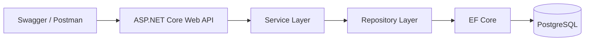
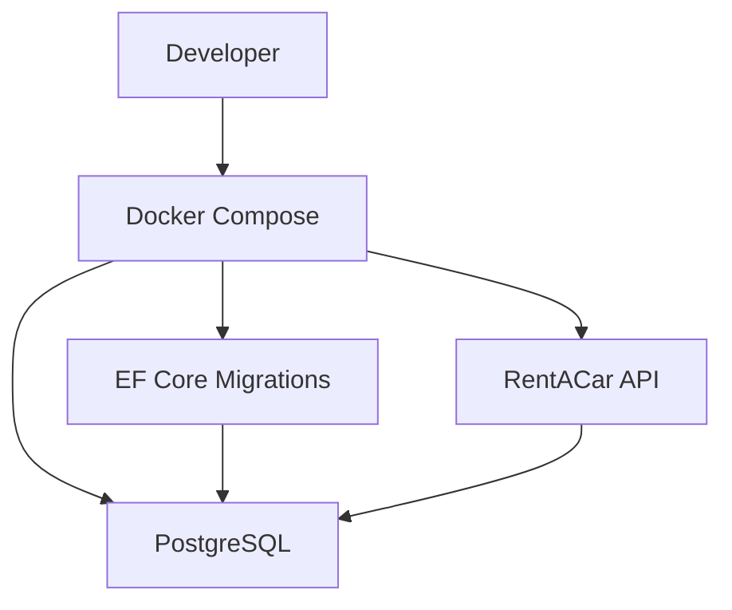
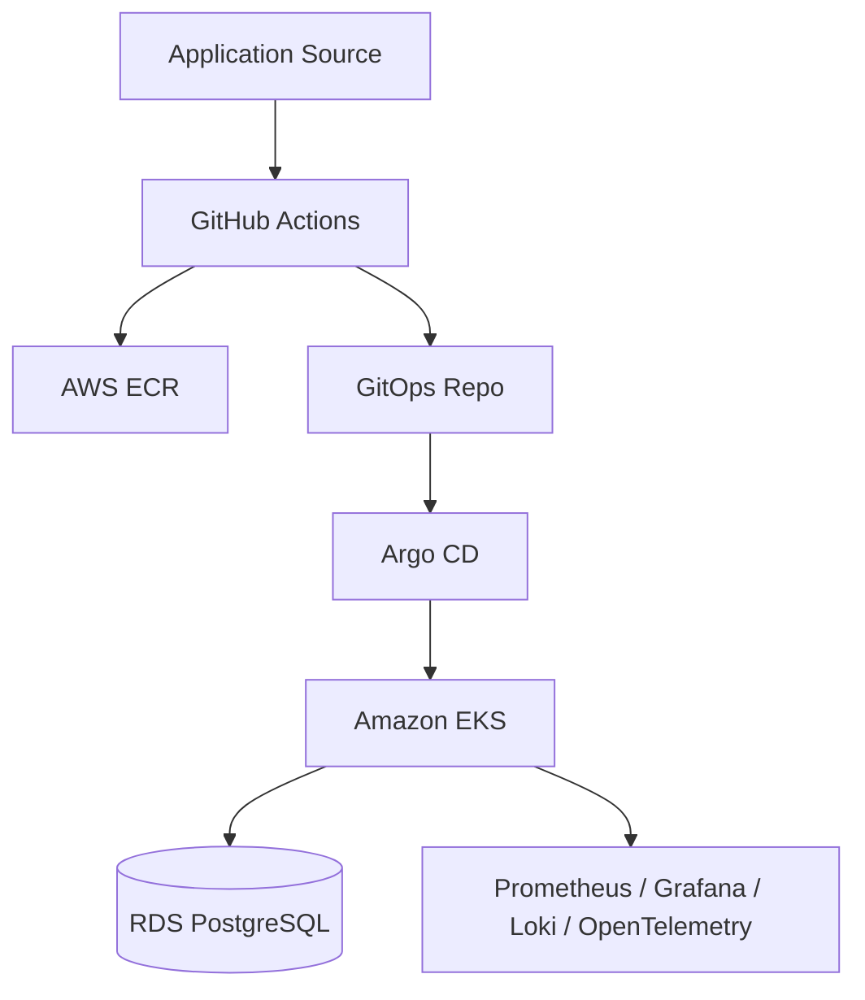

# RentACarApi

ASP.NET Core Web API ile geliştirilmiş basit bir Rent A Car backend projesidir.

Bu projenin ana amacı; REST API, Entity Framework Core, PostgreSQL, DTO, Service Layer, Repository Pattern, Docker Compose, test ve temel CI/CD mantığını gösterebilmektir.

> Not: `terraform/`, `helm/`, `gitops/` ve observability dosyaları production-ready mimariyi öğrenmek için hazırlanmış ileri seviye DevOps çalışmalarıdır. Gerçek AWS ortamında apply edilmedi; portfolio/learning amaçlıdır.

## Ana Backend Kapsamı

- ASP.NET Core Web API
- PostgreSQL
- Entity Framework Core Code First Migration
- DTO kullanımı
- Service Layer
- Repository Pattern
- Dependency Injection
- Swagger/OpenAPI
- Health check endpointleri
- Prometheus `/metrics` endpointi
- Docker Compose ile API + PostgreSQL
- Unit test ve integration test
- GitHub Actions CI

## Mimari



## Docker Compose

Lokal geliştirme için ana çalıştırma yöntemi:

```bash
docker compose up --build
```

Compose ile çalışan servisler:

- `postgres`: PostgreSQL veritabanı
- `migrations`: EF Core migration çalıştırıcı
- `api`: RentACar API



Erişim adresleri:

```text
http://localhost:8080/swagger
http://localhost:8080/health/live
http://localhost:8080/health/ready
http://localhost:8080/metrics
```

## Veritabanı Kuralları

Temel tablolar:

- Customers
- Vehicles
- VehicleTypes
- Branches
- Rentals

Önemli iş kuralı:

```text
Aynı araç çakışan tarih aralığında kiralanamaz.
```

Çakışma kontrolü:

```text
rentDate < existingRental.ReturnDate && returnDate > existingRental.RentDate
```

Kiralama oluştururken:

- Dönüş tarihi başlangıç tarihinden büyük olmalı.
- Customer, Vehicle ve Branch var olmalı.
- Araç seçilen tarih aralığında müsait olmalı.
- Toplam tutar gün sayısı x günlük fiyat olarak hesaplanır.

## API Endpointleri

Vehicles:

- `GET /api/vehicles`
- `GET /api/vehicles/{id}`
- `POST /api/vehicles`
- `PUT /api/vehicles/{id}`
- `DELETE /api/vehicles/{id}`

Customers:

- `GET /api/customers`
- `POST /api/customers`

Rentals:

- `GET /api/rentals`
- `POST /api/rentals`
- `GET /api/rentals/availability?vehicleId=1&rentDate=2026-06-21&returnDate=2026-06-24`

## Örnek Request Body

`POST /api/vehicles`

```json
{
  "brand": "Toyota",
  "model": "Corolla",
  "modelYear": 2022,
  "plateNumber": "34ABC123",
  "vehicleTypeId": 2
}
```

`POST /api/customers`

```json
{
  "firstName": "Utku",
  "lastName": "Ozturk",
  "email": "utku@example.com",
  "phoneNumber": "05555555555"
}
```

`POST /api/rentals`

```json
{
  "customerId": 1,
  "vehicleId": 1,
  "branchId": 1,
  "rentDate": "2026-06-20",
  "returnDate": "2026-06-25"
}
```

## Testler

Tüm testleri çalıştırmak için:

```bash
dotnet test RentACarApi.slnx --configuration Release
```

Test edilen başlıca senaryolar:

- Araç müsaitse kiralama oluşturulması
- Çakışan tarihte aynı aracın kiralanamaması
- Hatalı tarih aralığının reddedilmesi
- Kiralama tutarının doğru hesaplanması
- Eksik customer, vehicle veya branch durumları
- PostgreSQL migration ve repository davranışları

Integration testler Testcontainers kullanır; lokal PostgreSQL kurulu olmasına gerek yoktur.

## CI Pipeline

Pull request açıldığında GitHub Actions ile:

- restore
- build
- test
- coverage
- Docker build
- Trivy scan
- Gitleaks scan
- Docker Compose validation

çalışır.

## İleri DevOps Öğrenme Eklentileri

Bu bölüm junior backend projesinin ana kapsamı değildir. Production benzeri sistemlerin nasıl tasarlandığını öğrenmek için eklenmiştir.



Eklenen ileri seviye konular:

- `terraform/`: AWS VPC, EKS, RDS, ECR, IAM, GitHub OIDC altyapı kodları
- `helm/`: Kubernetes için reusable Helm chart
- `gitops/`: Argo CD App of Apps, dev/staging/production ayrımı
- `gitops/platform/observability`: Prometheus, Grafana, Loki, Promtail, OpenTelemetry Collector hazırlığı

Bu dosyalar gerçek AWS hesabında otomatik çalıştırılmaz. Önce plan/dry-run yapılmalı, maliyet ve güvenlik etkileri incelenmelidir.

## Faydalı Komutlar

```bash
dotnet restore RentACarApi.slnx
dotnet build RentACarApi.slnx --configuration Release
dotnet test RentACarApi.slnx --configuration Release
docker compose up --build
docker compose down -v
```

Makefile kullananlar için:

```bash
make help
make test
make docker-up
make smoke-test
make gitops-validate
```

## Öğrendiklerim

Bu projede özellikle şunları öğrendim:

- Backend katmanlarını sade ve okunabilir ayırma
- EF Core ile PostgreSQL modelleme
- DTO ile API request/response kontrolü
- Business rule yazma ve test etme
- Docker Compose ile lokal geliştirme ortamı kurma
- CI pipeline mantığı
- Production benzeri DevOps mimarisinin temel parçaları

## Kısa Not

Bu proje backend temellerini göstermek için tasarlanmıştır. İleri DevOps klasörleri, uzmanlık iddiasından çok öğrenme sürecini ve production mimarisine olan ilgiyi göstermek için eklenmiştir.
