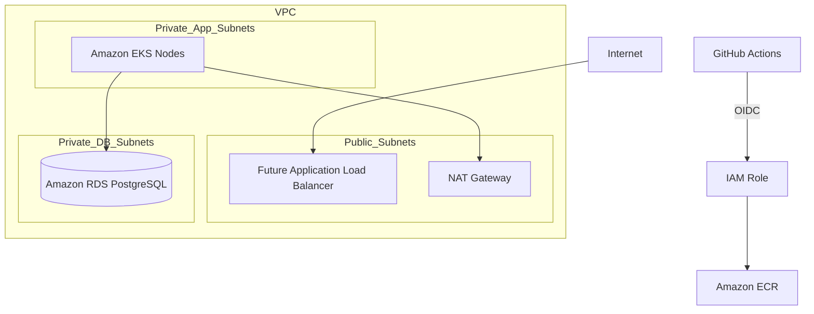

# AWS Architecture Foundation

Phase 3 defines reusable Terraform infrastructure for the RentACar API platform. It does not deploy the application, Helm charts, Argo CD, Prometheus, Grafana, Loki or canary releases.

The load balancer is shown as a future component. This phase creates the network, ECR, EKS, RDS, IAM/OIDC and budget foundation.

## Modules

- `networking`: VPC, public subnets, private application subnets, private database subnets, route tables, internet gateway and configurable NAT.
- `ecr`: immutable image repository for the API.
- `eks`: EKS control plane, managed node group, control-plane logs, encrypted Kubernetes secrets and managed add-ons.
- `rds`: private encrypted PostgreSQL with RDS-managed credentials.
- `github-oidc`: GitHub Actions federation and least-privilege ECR publisher role.
- `budget`: optional monthly AWS budget.

## Network Design

Each environment spans at least two availability zones. Public subnets are reserved for future public load balancers and NAT gateways. EKS worker nodes run in private application subnets. RDS runs in private database subnets and is not publicly accessible.

NAT mode is configurable:

- `single`: lower cost, lower availability, useful for development.
- `per_az`: higher cost, better AZ resilience, preferred for production.
- `disabled`: only for special test networks that do not need outbound internet.

## EKS Design

The EKS module enables API, audit, authenticator, controller manager and scheduler logs. Managed node groups use private subnets. The node role has node-level permissions only. Future AWS integrations should use EKS Pod Identity roles rather than broad permissions on the node role.

## RDS Design

PostgreSQL is private, encrypted and protected by a security group that only allows port `5432` from approved application security groups. Master credentials are managed by RDS in AWS Secrets Manager. Terraform outputs only the secret ARN, never the plaintext password.
