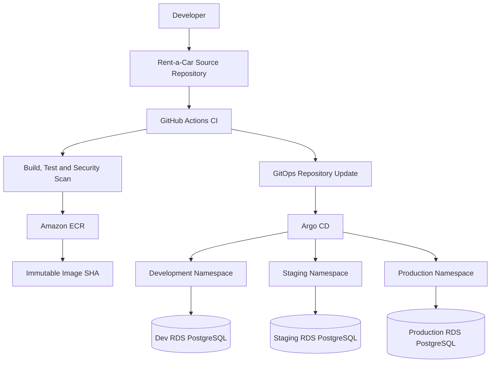

# GitOps Architecture

Phase 5 moves deployment state into Git and prepares Argo CD to reconcile Amazon EKS from that state.

Logical repositories:

- `rentacar-backend-api`: application source, tests, Dockerfile and CI image pipeline.
- `rentacar-platform`: Terraform, Helm chart, Argo CD bootstrap and platform docs.
- `rentacar-gitops`: environment values, desired image tags and Argo CD Applications.

In this workspace, `gitops/` models the future `rentacar-gitops` repository and can be moved later.

Git is the source of truth for chart configuration, image tags, replica counts, resources, ingress settings, HPA settings and secret references. Secrets themselves are not stored in Git.

ApplicationSet decision: this phase uses three explicit Argo CD Applications instead of ApplicationSet. The environments have different sync policies, retry windows and production approval expectations, so separate Application manifests are easier to review for a portfolio project. ApplicationSet can be introduced later if many similar services or regions are added.

Sync waves:

- Wave `-3`: namespace and prerequisite configuration.
- Wave `-2`: ExternalSecret so database credentials exist before workloads start.
- Wave `-1`: EF Core migration Job as an Argo CD PreSync hook.
- Wave `0`: ServiceAccount, ConfigMap, Service and Deployment.
- Wave `1`: Ingress, HPA, PDB and NetworkPolicy.
- Wave `2`: PostSync smoke-test Job.
