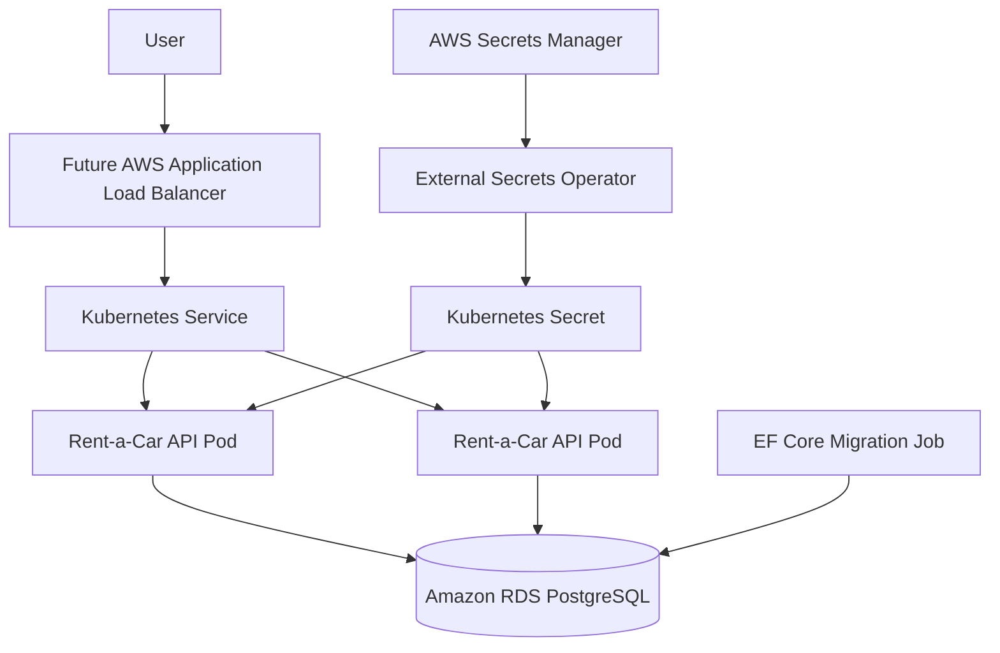

# Helm Chart

The canonical chart is `helm/rentacar-api`. The older `deploy/helm` chart was removed to avoid duplicate deployment definitions.

The chart includes:

- Deployment
- Service
- Ingress
- ConfigMap
- ExternalSecret
- ServiceAccount
- EF Core migration Job
- HPA
- PodDisruptionBudget
- NetworkPolicy
- optional ServiceMonitor
- Helm test pod



The ALB, External Secrets Operator, Metrics Server and Prometheus Operator are prerequisites or future components. They are not installed by this chart.

## Values Hierarchy

- `values.yaml`: secure base defaults.
- `values-dev.yaml`: 1 replica, lower resources, Swagger enabled, HPA/PDB/NetworkPolicy disabled by default.
- `values-staging.yaml`: 2 replicas, HPA, PDB and NetworkPolicy enabled.
- `values-production.yaml`: 2+ replicas, HPA, PDB, NetworkPolicy, TLS-ready ingress and ExternalSecret enabled.

## Image Tagging

Set image values during install:

```bash
--set image.repository=<ecr-url> \
--set image.tag=<commit-sha>
```

The chart fails if image repository or tag is empty, and it rejects `latest`.
