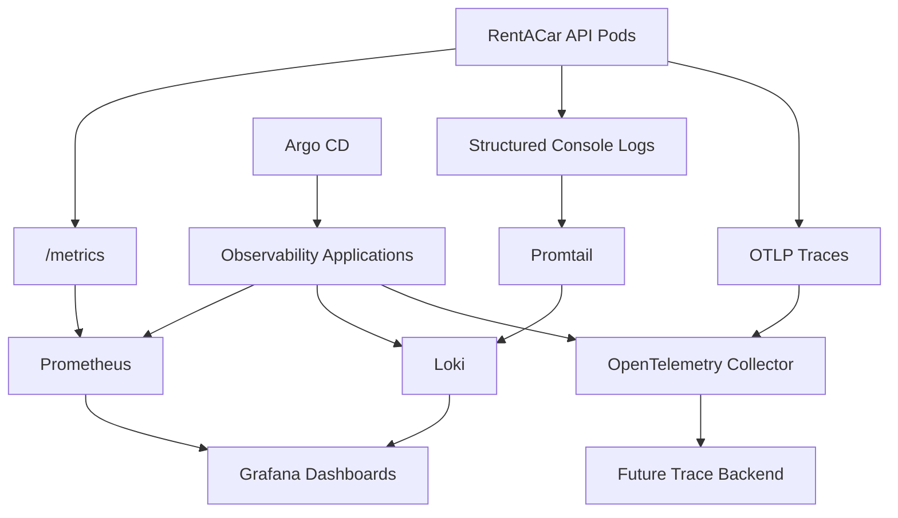

# Observability Architecture

Phase 6 adds a GitOps-managed observability foundation for the RentACar API.

Components:

- `kube-prometheus-stack`: Prometheus, Alertmanager, Grafana, Prometheus Operator and CRDs.
- `loki`: log storage for Kubernetes workload logs.
- `promtail`: DaemonSet log shipper from nodes to Loki.
- `opentelemetry-collector`: receives OTLP traces from the API.

The RentACar API Helm chart does not install the platform stack. It only creates application-owned observability resources:

- `ServiceMonitor` for `/metrics`.
- `PrometheusRule` for basic API alerts.
- Grafana dashboard ConfigMap for the Grafana sidecar.
- OTLP environment variables for tracing.

This keeps platform ownership separate from application deployment ownership.

The current Collector exports traces to the `debug` exporter. A real backend such as Tempo, Jaeger or an external APM can be added later without changing the API image.
